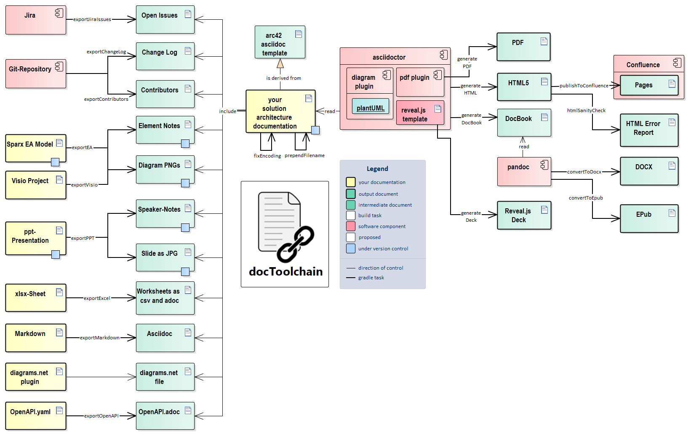

== Where to store documentation

++++
<section tagcloud>
    Configuration files
    Source Code
    Powerpoint
    Word
    Git commit
    Non existent
    Jira
    Confluence Wiki
    Drive Documents
    The Developers Brain
    AsciiDoc
    Markdown
 </section>
++++

== Doc-as-Code
[.notes]
****
* nicht generiert wie JavaDoc
* Swagger
****

[%notitle]
== DocToolchain

== Antora
[source, yaml]
----
site:
  title: Antora Demo Site
  url: https://antora.gitlab.io/demo/docs-site
  start_page: component-b::index.adoc
content:
  sources:
  - url: https://gitlab.com/antora/demo/demo-component-a.git
    branches: HEAD
    edit_url: false
  - url: https://gitlab.com/antora/demo/demo-component-b.git
    branches: [v1.0, v2.0, main]
    start_path: docs
ui:
  bundle:
    url: https://gitlab.com/antora/antora-ui-default/-/jobs/artifacts/HEAD/raw/build/ui-bundle.zip?job=bundle-stable
    snapshot: true
----

== Antora Component
[source,yaml]
----
name: component-b
title: Component B
version: 2.5
prerelease: -beta.1
nav:
- modules/ROOT/nav.adoc
- modules/module-one/nav.adoc
----

[%notitle,background-iframe="https://antora.gitlab.io/demo/docs-site/component-b/2.0/index.html"]
== Antora Demo

[%notitle,background-image="https://images.unsplash.com/photo-1609710804324-c607807e241f?ixlib=rb-1.2.1&ixid=MnwxMjA3fDB8MHxwaG90by1wYWdlfHx8fGVufDB8fHx8&auto=format&fit=crop&w=1742&q=80"]
== Documentation = &#10084;

:box-background-color: rgba(255,255,255,0.8)
:box-title: Documentation = ❤
:box-title-color: black
include::../_shared/title_with_box.adoc[]

[%notitle, background-image="https://images.unsplash.com/photo-1594718200327-17b749e753e6?ixlib=rb-1.2.1&ixid=MnwxMjA3fDB8MHxwaG90by1wYWdlfHx8fGVufDB8fHx8&auto=format&fit=crop&w=1740&q=80"]
== Dont know
[.notes]
****
* aber ich weiß nicht wie
* was soll ich denn schreiben
* ich hab keine Zeit
****

[.columns]
== Someone already did it

[.column.bullet-less%step, data-context="with-list-header"]
* Templates
* Arc42
* ADRs
* ...

[.column.bullet-less%step, data-context="with-list-header"]
* Tooling
* DocToolchain
* Antorra
* Backstage.io
* ...

[.column.bullet-less%step, data-context="with-list-header"]
* Misc
* Style-Guides
* Agile methodologies
* ...

[.notes]
****
* Microsoft/ Rackspace Styleguide techn writing
* Agile -> kleine happen direkt mit entwicklung schreiben
****
